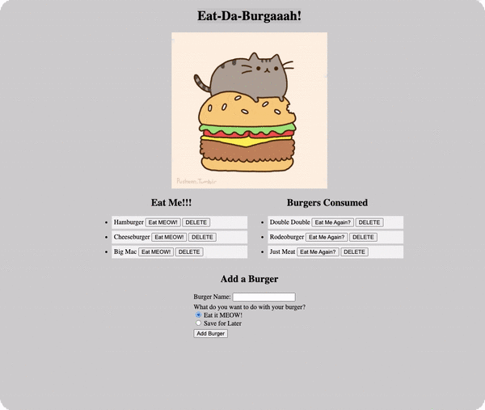

# Eat-Da-Burgaaah!
Try it out [here](https://stark-river-49417.herokuapp.com/)

## Description
Eat-Da-Burgaaah! is a restaurant app that lets users input the names of burgers they'd like to eat. The inputted burgers will be on the right of the screen, the eaten burgers will be on the left. The user has many options with the burgers, they can eat it or delete it if their taste changes and they no longer wish to have that burger as an option. Once eaten the user can select to have that burger be available to eat again, because who can stop with eating just one delicious burger, or delete it. If the user wants to add their favorite burger they have the power and are encouraged to do so. They will have the option to eat it right away or put it on the list of burgers to eat and they can consume it at their leisure.**WARNING**
Using this app may cause extreme HUNGER and the urge to EAT-DA-BURGAAAH!!

## Table of Contents

  - [Description](#description)
  - [Technologies Used](#technologies-used)
  - [Contributing](#contributing)
  - [License](#license)
  - [GitHub Repo, Profile, Questions](#github-repo-profile-questions)

## Technologies Used
* CSS
* Express
* Heroku
* HTML
* JavaScript
* JawsDB
* mySQL

## Contributing
1. Fork it!
2. Create your branch: `git checkout -b "your branch name here"`
3. Add and commit your changes
4. Push to your branch
5. Submit a pull request

## License

## GitHub Repo, Profile, Questions
* View [Eat-Da-Burgaaah!](https://stark-river-49417.herokuapp.com/) Live on Heroku
* [Repository](https://github.com/brandt-fricker/EatBurgers)
* [GitHub Profile](https://github.com/brandt-fricker)
* Any questions, comments, or concerns please feel free to contact me via email, all my info can be found [here](images/Resume.pdf)

